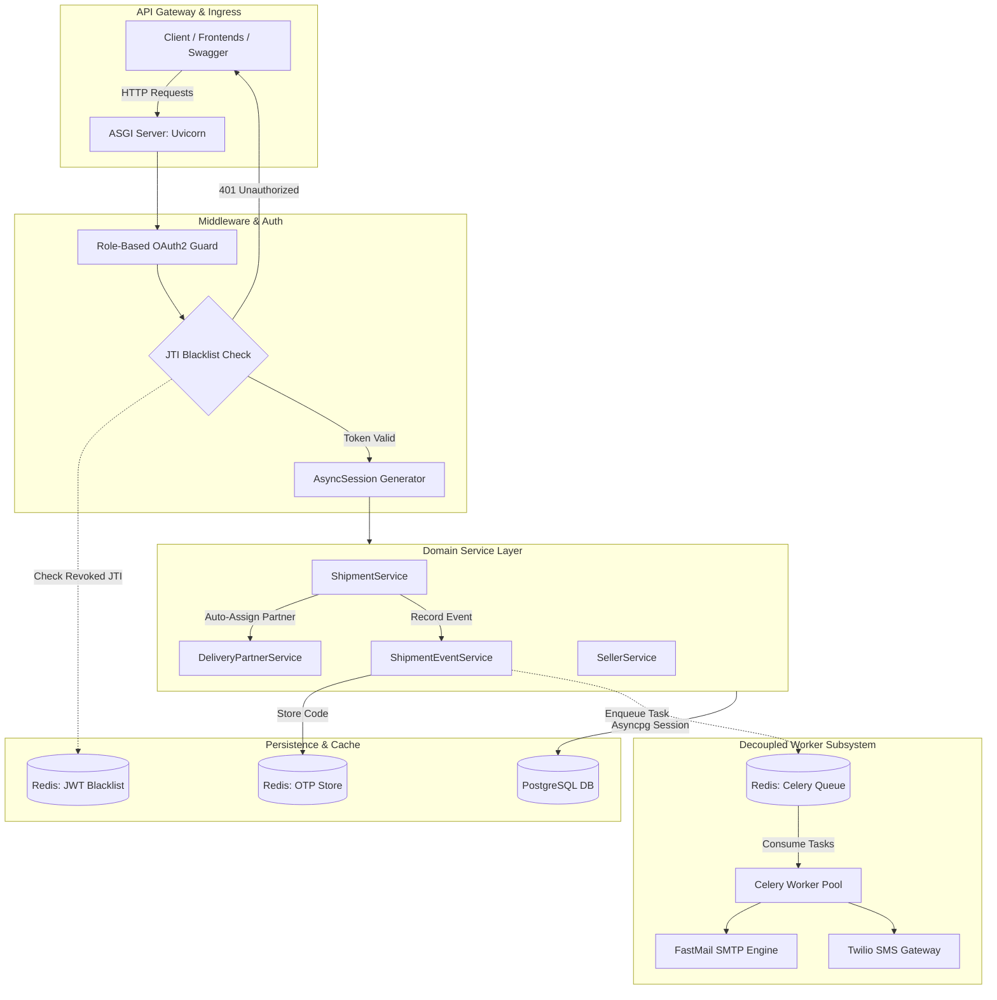
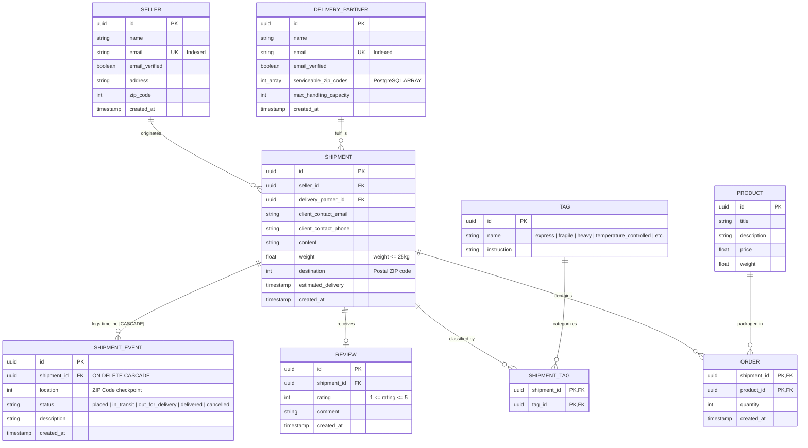
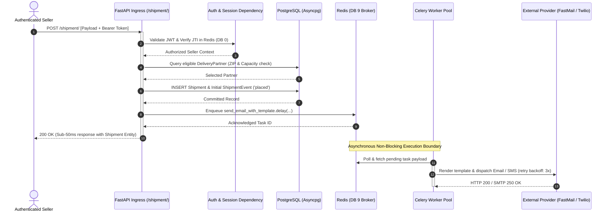
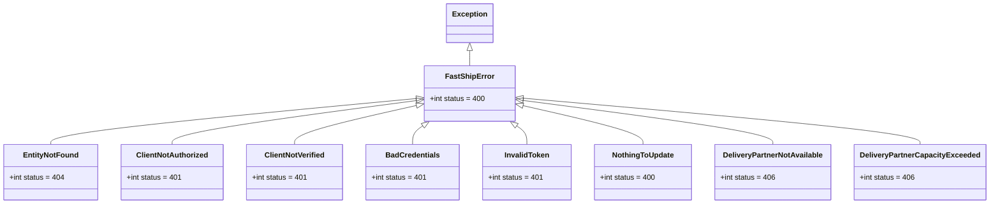

# FastShip Backend

[](https://fastapi.tiangolo.com/)
[](https://www.python.org/)
[](https://www.postgresql.org/)
[](https://redis.io/)
[](https://docs.celeryq.dev/)
[](https://alembic.sqlalchemy.org/)
[](https://www.twilio.com/)
[](https://opensource.org/licenses/MIT)

FastShip is a distributed, event-driven parcel logistics and shipment orchestration backend designed for high concurrency and deterministic latency. Built on **FastAPI**, **SQLModel / SQLAlchemy (Asyncpg)**, **Redis**, and **Celery**, FastShip separates high-throughput synchronous transactional workloads from latency-variable downstream integrations (such as carrier route assignment, SMTP rendering, and Twilio SMS delivery).

---

## 1. Project Identity & Architecture Overview

### High-Level Pitch
Modern logistics workflows demand sub-50ms API ingress for dispatchers alongside rigorous consistency guarantees for capacity allocation, custody tracking, and role-segregated operations. FastShip resolves the classic I/O bottleneck by structuring transactional workflows around asynchronous non-blocking event loops, transactional ACID storage in PostgreSQL, and offloading heavy compute and external network I/O to background Celery worker pools through Redis broker queues.

### Core Tech Stack
* **Web Framework:** [FastAPI](https://fastapi.tiangolo.com/) (Async ASGI architecture over Python 3.10+)
* **Database Driver & ORM:** [PostgreSQL](https://www.postgresql.org/) via [asyncpg](https://github.com/MagicStack/asyncpg) and [SQLModel](https://sqlmodel.tiangolo.com/) / [SQLAlchemy 2.0](https://www.sqlalchemy.org/)
* **Database Migrations:** [Alembic](https://alembic.sqlalchemy.org/) (Asynchronous migration pipeline)
* **Session Cache & Security Store:** [Redis](https://redis.io/) (Async client for token blacklisting & one-time delivery verification codes)
* **Distributed Task Queue:** [Celery](https://docs.celeryq.dev/) (Task broker & backend powered by Redis)
* **Notification Engines:** [FastAPI-Mail](https://sabuhish.github.io/fastapi-mail/) (Jinja2 HTML email dispatch) & [Twilio](https://www.twilio.com/) (Carrier-grade transactional SMS)
* **ASGI Server & API Engine:** [Uvicorn](https://www.uvicorn.org/) with native Swagger UI, ReDoc, and [  Scalar](https://github.com/scalar/scalar) OpenAPI spec integration

### System Architecture



### Architectural Rationale: Decoupled Non-Blocking Topology
In standard monolithic logistics platforms, synchronous operations—such as sending SMS notifications, rendering email templates, or synchronizing third-party carrier APIs—block the primary request-handling thread. FastShip adheres to strict decoupling principles:
1. **Zero-Wait I/O Ingress:** The FastAPI request loop interacts exclusively with in-memory Redis checks and asynchronous PostgreSQL connection pools (`asyncpg`), guaranteeing sub-millisecond network turnaround for the client.
2. **Failure Isolation:** An outage in an external email relay or Twilio endpoint does not degrade the core shipment creation or updating pipeline. Tasks are durable, serialized, and retried independently in Celery worker processes.
3. **Independent Horizontal Scalability:** The stateless API service (Uvicorn) can be autoscaled based on HTTP ingress traffic, while the worker pool scales independently according to task queue pressure and downstream provider rate limits.

---

## 2. Relational Schema & Data Modeling

The data architecture is structured around high-integrity relational invariants, explicit cascade boundaries, and composite keys managed through SQLModel and PostgreSQL.

### Visual Schema (Entity-Relationship Diagram)



### Data Modeling & Schema Design Choices

1. **Composite Primary Keys on Associative Tables:**
   * Many-to-Many associations between `Shipment` $\leftrightarrow$ `Tag` (`ShipmentTag`) and `Shipment` $\leftrightarrow$ `Product` (`Order`) use composite primary keys `(shipment_id, tag_id)` and `(shipment_id, product_id)`. This enforces physical uniqueness at the database engine level, prevents duplicate joins, and creates an automatic B-tree index on the lead key without requiring redundant synthetic surrogate keys (`id`).

2. **Cascade Deletions & Audit Integrity:**
   * The `ShipmentEvent` table records granular status changes (`placed`, `in_transit`, `out_for_delivery`, `delivered`, `cancelled`).
   * A strict `foreign_key="shipment.id", ondelete="CASCADE"` constraint alongside SQLAlchemy's `cascade="all, delete-orphan"` guarantees that purging a shipment cleanly prunes its historical timeline without leaving orphaned checkpoints or inconsistent state.

3. **PostgreSQL Native Array Columns & Capacity Engine:**
   * The `DeliveryPartner` entity leverages PostgreSQL's native `ARRAY(INTEGER)` column for `serviceable_zip_codes`. 
   * Dynamic partner matching operates through SQLModel's `zipcode == any_(DeliveryPartner.serviceable_zip_codes)` filter, eliminating an entire lookup join table while supporting dynamic partner capacity checks against active concurrent shipments (`current_handling_capacity = max_handling_capacity - len(active_shipments)`).

4. **Zero-Downtime Schema Evolution with Alembic:**
   * Schema migrations in `migrations/` operate via an asynchronous engine bridge (`async_engine`) directly bound to `SQLModel.metadata`.
   * Migrations are fully auditable, forward-compatible, and support incremental rollbacks (`alembic downgrade -1`) to maintain database integrity across staging and production environments.

---

## 3. Deep-Dive: Core Engineering Mechanisms

### Asynchronous Execution & Background Worker Pipeline
The order booking process (`POST /shipment/`) executes under strict sub-50ms performance targets. Heavy operations—such as compiling transactional Jinja2 HTML email templates or sending network-bound SMS messages through the Twilio API—are immediately delegated to the Celery worker pool.



### Security & Session Management: Dual OAuth2 & Stateful Revocation
FastShip avoids generic monolithic user models by separating access boundaries into distinct operational roles:

* **Dual OAuth2 Bearer Schemes:**
  * Independent token generation endpoints: `/seller/token` for merchants and `/partner/token` for couriers.
  * Tokens are cryptographically signed using HS256 and embed the actor role, standard claims, expiration timestamps, and an unpredictable cryptographic UUID `jti` (JWT ID).

* **Stateful Revocation via Redis JTI Blacklisting:**
  * **The Problem:** Stateless JWTs cannot be revoked prior to expiration without rotating signing keys, exposing systems to replay attacks if a token is compromised.
  * **The Solution:** On `/seller/logout` or `/partner/logout`, the token's `jti` is stored in an in-memory Redis cluster (`DB 0`). 
  * The global FastAPI dependency (`_get_access_token`) executes an O(1) Redis `EXISTS` check on every authenticated request. If the `jti` is blacklisted, an immediate `401 Unauthorized` is returned, terminating the session across all distributed instances.

* **Tamper-Proof Cryptographic Action Tokens:**
  * Out-of-band actions (such as email verification, password reset links, and delivery review submissions) use `itsdangerous.URLSafeTimedSerializer` with distinct salt strings (`shipment-review`, `password-reset`). This ensures URL safety, timestamp expiration, and payload tamper detection without polluting database session tables.

### Centralized Exception Architecture
To prevent leaked stack traces, avoid ad-hoc `try-except` blocks in route controllers, and ensure standard RFC 7807-compliant HTTP error payloads, the application implements a centralized error hierarchy in `app/core/exceptions.py`.



* **Dynamic Handler Registration:** At application startup, `add_exception_handlers(app)` inspects all subclasses of `FastShipError` using reflection (`__subclasses__()`).
* **Deterministic Status Mapping:** When a service raises `DeliveryPartnerCapacityExceeded`, the exception handler automatically translates it to an `HTTP 406 Not Acceptable` response using the class docstring as the client-facing error message, keeping domain services decoupled from HTTP framework specifics.

---

## 4. Repository Layout & File Responsibilities

```text
app/
├── main.py                   # Application factory: lifespan hooks, middleware, & router mount
├── config.py                 # Pydantic BaseSettings: strict schema validation for .env configuration
├── utils.py                  # Cryptographic utilities: JWT encoding/decoding, JTI generation, URL serializers
├── api/                      # Presentation Layer (HTTP transport & request lifecycle)
│   ├── router.py             # Root APIRouter aggregating all domain sub-routers
│   ├── dependencies.py       # Composition root: AsyncSession injection, OAuth2 guards, & service factories
│   ├── routers/              # Controller modules exposing versioned REST endpoints
│   │   ├── seller.py         # Merchant registration, OAuth2 token issuance, verification, password resets
│   │   ├── delivery_partner.py # Partner registration, authentication, capacity updates, logout
│   │   └── shipment.py       # Shipment booking, status updates, tracking views, review submission
│   └── schemas/              # Data Transfer Objects (DTOs): Pydantic input validation & response filtering
│       ├── seller.py
│       ├── delivery_partner.py
│       └── shipment.py
├── core/                     # Cross-Cutting Architectural Foundations
│   ├── exceptions.py         # Custom FastShipError class hierarchy and reflection-based handlers
│   └── security.py           # OAuth2PasswordBearer route specifications for role segregation
├── database/                 # Persistence & Data Access Layer
│   ├── models.py             # SQLModel declarative schema definitions (tables, relationships, indexes)
│   ├── session.py            # Async engine configuration, session maker, and table bootstrap
│   └── redis.py              # Async Redis client for JTI token blacklisting and OTP verification codes
├── services/                 # Domain Business Logic (Pure Python orchestrators)
│   ├── base.py               # Generic CRUD base service with common async database operations
│   ├── user.py               # Shared user lifecycle management, credential validation, and token signing
│   ├── seller.py             # Seller domain logic and password reset workflows
│   ├── delivery_partner.py   # Courier assignment engine (geographic routing & capacity boundaries)
│   ├── shipment.py           # Core logistics workflow: parcel creation, transition management, reviews
│   └── shipment_event.py     # Checkpoint timeline tracking and event-driven notification triggers
├── templates/                # Server-Side Presentation & Notification Assets
│   ├── track.html            # Jinja2 public parcel tracking timeline interface
│   ├── review.html           # Jinja2 customer feedback & rating submission portal
│   └── mail_*.html           # Transactional HTML email templates (placed, out for delivery, delivered)
└── worker/                   # Asynchronous Distributed Processing Subsystem
    ├── main.py               # Diagnostic ASGI application for test task dispatch
    └── tasks.py              # Celery tasks: background email dispatch & Twilio SMS with exponential backoff
```

---

## 5. Local Environment & Deployment Setup

### Prerequisites
* **Python:** `3.10` or newer
* **PostgreSQL:** Running instance (`localhost:5432`)
* **Redis:** Running instance (`localhost:6379`)

### Step 1: Clone Repository & Create Virtual Environment

**On Windows (PowerShell):**
```powershell
git clone https://github.com/vorakshat/FastShip.git
cd FastShip
python -m venv venv
.\venv\Scripts\Activate.ps1
```

**On Linux / macOS (Bash):**
```bash
git clone https://github.com/vorakshat/FastShip.git
cd FastShip
python3 -m venv venv
source venv/bin/activate
```

### Step 2: Install Dependencies
```bash
pip install --upgrade pip
pip install -r requirements.txt
```

### Step 3: Configure Environment Variables
Create a `.env` file in the root directory and populate the required parameters:

```env
# Application Settings
APP_NAME=FastShip
APP_DOMAIN=localhost:8000

# PostgreSQL Configuration
POSTGRES_SERVER=localhost
POSTGRES_PORT=5432
POSTGRES_USER=postgres
POSTGRES_PASSWORD=your_secure_password
POSTGRES_DB=fastship_db

# Redis Configuration
REDIS_HOST=localhost
REDIS_PORT=6379

# Security & Cryptography
JWT_SECRET=generate_a_high_entropy_32_character_secret_key
JWT_ALGORITHM=HS256

# SMTP Mail Dispatch Settings
MAIL_USERNAME=notifications@fastship.com
MAIL_PASSWORD=your_smtp_app_password
MAIL_FROM=no-reply@fastship.com
MAIL_FROM_NAME=FastShip Logistics
MAIL_SERVER=smtp.gmail.com
MAIL_PORT=587
MAIL_STARTTLS=True
MAIL_SSL_TLS=False
USE_CREDENTIALS=True
VALIDATE_CERTS=True

# Twilio Transactional SMS
TWILIO_SID=ACXXXXXXXXXXXXXXXXXXXXXXXXXXXXXXXX
TWILIO_AUTH_TOKEN=your_twilio_auth_token
TWILIO_NUMBER=+1234567890
```

### Step 4: Execute Database Migrations
Initialize the schema and execute all pending migration revisions:

```bash
# Upgrade database to the latest revision
alembic upgrade head

# (Optional) Verify current migration version
alembic current
```

### Step 5: Launch Uvicorn API Server & Celery Worker

Open two terminal sessions with the virtual environment activated:

**Terminal 1 — API Server:**
```bash
uvicorn app.main:app --host 0.0.0.0 --port 8000 --reload
```

**Terminal 2 — Celery Task Worker:**
```bash
celery -A app.worker.tasks.app worker --loglevel=info
```

---

## 6. Interactive API Reference

FastShip ships with real-time, self-documenting API interfaces:

* **Interactive Swagger UI:** [http://localhost:8000/docs](http://localhost:8000/docs)
* **ReDoc Specification:** [http://localhost:8000/redoc](http://localhost:8000/redoc)
* **Scalar Modern API Reference:** [http://localhost:8000/scalar](http://localhost:8000/scalar)

### Core Endpoint Summary

| HTTP Method | Route Path | Description | Authentication / Guard |
| :--- | :--- | :--- | :--- |
| **Seller Subsystem** | | | |
| `POST` | `/seller/signup` | Register a new seller/merchant organization | Public |
| `POST` | `/seller/token` | Authenticate seller and obtain JWT Bearer token | Public (OAuth2 Form) |
| `GET` | `/seller/verify` | Confirm and activate seller email account via timed token | Public |
| `POST` | `/seller/forgot_password` | Dispatch password reset token link to registered email | Public |
| `GET` | `/seller/reset_password_form` | Render HTML password reset web interface | Public |
| `POST` | `/seller/reset_password` | Validate timed token and update user password | Public |
| `GET` | `/seller/logout` | Revoke session and add token JTI to Redis blacklist | **Bearer (Seller)** |
| **Delivery Partner Subsystem** | | | |
| `POST` | `/partner/signup` | Register a new delivery partner with zip codes & capacity | Public |
| `POST` | `/partner/token` | Authenticate delivery partner and issue JWT Bearer token | Public (OAuth2 Form) |
| `GET` | `/partner/verify` | Confirm and activate delivery partner account | Public |
| `POST` | `/partner/` | Update partner profile, active zip codes, or capacity limits | **Bearer (Partner)** |
| `GET` | `/partner/logout` | Revoke partner session and add JTI to Redis blacklist | **Bearer (Partner)** |
| **Shipment & Tracking Subsystem** | | | |
| `POST` | `/shipment/` | Book parcel: auto-assigns partner & enqueues notifications | **Bearer (Seller)** |
| `GET` | `/shipment/` | Fetch full shipment details and nested tracking timeline | **Bearer (Seller)** |
| `PATCH` | `/shipment/` | Update shipment state (requires OTP for `delivered` status) | **Bearer (Partner)** |
| `GET` | `/shipment/cancel` | Cancel an active shipment and append cancellation event | **Bearer (Seller)** |
| `DELETE` | `/shipment/` | Delete shipment record and cascade-delete its event timeline | Public |
| `GET` | `/shipment/track` | Render public responsive HTML tracking timeline interface | Public |
| `GET` | `/shipment/tagged` | Query shipments filtered by logistic tag (e.g., `fragile`) | Public |
| `GET` | `/shipment/tag` | Associate a classification tag with a shipment | Public |
| `DELETE` | `/shipment/remove_tag` | Dissociate a classification tag from a shipment | Public |
| `GET` | `/shipment/review` | Render HTML feedback & rating submission form | Public (Signed Token) |
| `POST` | `/shipment/review` | Record customer rating (1-5) and feedback for delivered parcel | Public (Signed Token) |
